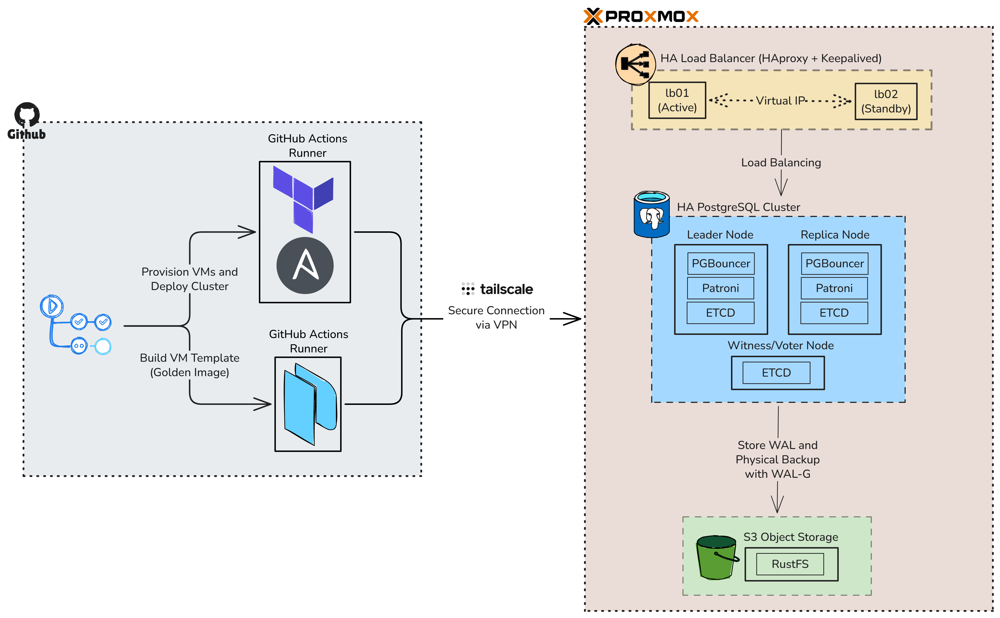

# 🚀 Enterprise HA PostgreSQL Cluster on Proxmox

<div align="center">
    <!-- Your badges here -->
    
    
    
    
    
    
</div>
<br>

This repository contains a fully automated, **Zero-Touch Provisioning** pipeline to deploy an Enterprise-Grade High Availability PostgreSQL Cluster on Proxmox VE. This project is built on the principles of **GitOps**, **Infrastructure as Code (IaC)**, and **CI/CD**. By simply triggering a GitHub Action, you can spin up a HA and resilient database architecture from scratch in minutes.

---

## 🏗️ Architecture Overview



This pipeline provisions **6 Virtual Machines** cloned from a pre-built Packer Golden Image:
1. **`node01` & `node02`**: PostgreSQL Database instances managed by **Patroni** and **PgBouncer** (Leader/Replica).
2. **`node03`**: **etcd Witness** node to maintain quorum and prevent **split-brain** scenarios.
3. **`node04` & `node05`**: High Availability Load Balancers using **HAProxy** and **Keepalived** (VRRP) to manage a single **Virtual IP (VIP)**.
4. **`node06`**: **RustFS** (S3-compatible Object Storage) for Continuous Archiving and Point-in-Time Recovery (PITR) using **WAL-G**.

---

## 💡 Why is this Project Extremely Powerful?

* 👑 **Single Source of Truth (GitOps):** The `terraform/main.tf` file dictates the absolute reality of your infrastructure. To change your infrastructure, you change the code. No more manual clicking in the Proxmox UI or SSH-ing to servers to tweak configs.
* 🛡️ **Strict Idempotency:** You can run this pipeline 100 times in a row safely. Terraform will only provision what's missing, and Ansible will only restart services if configurations actually change.
* 📈 **Effortless to Scale:** Want to add a 3rd PostgreSQL replica? Just add **one line of code** in the `locals` block of `terraform/main.tf` and push to `master`. Terraform provisions the VM, Ansible dynamically updates the `/etc/hosts` on all nodes, deploys Patroni, configures the new replica to stream from the Leader, and seamlessly injects it into the HAProxy load balancer with zero downtime.
* 🔒 **Impenetrable Security (Tailscale Bastion):** The GitHub Actions runner securely tunnels into your local Proxmox environment using a Tailscale ephemeral node. You **do not** need to expose your Proxmox API or SSH ports to the public internet.
* ☁️ **Remote State Management:** Terraform state is securely stored and versioned in **HCP Terraform (Terraform Cloud)**, preventing state corruption and enabling team collaboration.
* 🔄 **Self-Healing:** If a PostgreSQL Leader crashes, Patroni automatically promotes a Replica, and HAProxy routes traffic to the new Leader. If the primary Load Balancer crashes, Keepalived throws the VIP to the backup Load Balancer in milliseconds.

---

## 🛠️ Prerequisites

Before running this pipeline, ensure you have the following:

1. **Proxmox VE Cluster**: With API access enabled.
2. **Packer Golden Image**: A base Ubuntu VM template (e.g., Template ID `240`) pre-installed with Docker and Cloud-Init.
3. **Tailscale**: A Tailscale network. Your Proxmox host (or a Bastion LXC) must be connected to this Tailscale network to act as a proxy.
4. **HCP Terraform Account**: A free account at [app.terraform.io](https://app.terraform.io) to store the state file.

---

## ⚙️ Initial Setup & Configuration
### 1. Create VM Template on Proxmox using Packer
1. Go to this GitOps Infrastructure as Code for Proxmox repository [Proxmox GitOps IaC](https://github.com/omidiyanto/proxmox-gitops-infrastructure-as-code.git)
2. Clone/fork the repository, and build VM template on your Proxmox node first.
3. The result of this steps, you'll get your own Golden Image as VM Template.

### 2. HCP Terraform (State Storage)
1. Go to [HCP Terraform](https://app.terraform.io).
2. Create an **Organization** and a **Workspace** (e.g., `ha-postgresql`).
3. Under the Workspace Settings -> General, change the **Execution Mode** to **Local**. (This allows GitHub Actions to do the heavy lifting while Terraform Cloud only stores the `terraform.tfstate`).
4. Generate a User API Token to be used in GitHub Secrets.

### 3. GitHub Secrets Configuration
Navigate to your GitHub Repository -> **Settings** -> **Secrets and variables** -> **Actions**. Add the following repository secrets:

| Secret Name | Description | Example |
| :--- | :--- | :--- |
| `HCP_ORG` | Your HCP Terraform Organization name. | `my-corp-infra` |
| `HCP_WORKSPACE` | Your HCP Terraform Workspace name. | `ha-postgresql` |
| `TF_API_TOKEN` | HCP Terraform User API Token. | `***` |
| `TS_OAUTH_CLIENT_ID` | Tailscale OAuth Client ID (Tag: `ci`). | `***` |
| `TS_OAUTH_SECRET` | Tailscale OAuth Secret. | `***` |
| `PROXMOX_API_URL` | Proxmox API URL via Tailscale. | `https://pve.tail1a8407.ts.net:8006` |
| `PROXMOX_TOKEN_ID` | Proxmox API Token ID. | `root@pam!iac` |
| `PROXMOX_TOKEN_SECRET` | Proxmox API Token Secret. | `***` |
| `PROXMOX_TAILSCALE_HOSTNAME`| The Tailscale IP or MagicDNS of the Proxmox Host/Bastion. | `pve.tail1a8407.ts.net` |
| `SSH_PRIVATE_KEY_B64` | Base64 encoded Private Key for SSH. | `$(cat ~/.ssh/id_ed25519 \| base64 -w 0)` |
| `SSH_PUBLIC_KEY_B64` | Base64 encoded Public Key. | `$(cat ~/.ssh/id_ed25519.pub \| base64 -w 0)` |

**Database & Application Secrets:**

| Secret Name | Description | Example |
| :--- | :--- | :--- |
| `PATRONI_CLUSTER_NAME` | The name of your Patroni cluster. | `pgcluster` |
| `POSTGRES_PASSWORD` | Superuser password for PostgreSQL. | `SuperSecret123!` |
| `PGPASSWORD_ADMIN` | Admin password for Patroni management. | `AdminPass123!` |
| `PGPASSWORD_STANDBY` | Password for Patroni replication. | `ReplicationPass123!` |
| `ETCD_ROOT_PASSWORD` | Root password for etcd cluster. | `EtcdSecurePass` |
| `ETCD_CLUSTER_TOKEN` | Unique token for etcd cluster bootstrapping. | `my-etcd-token-xyz` |
| `S3_BUCKET_NAME` | Name of the bucket to create in RustFS. | `pg-backup` |
| `S3_ROOT_USER` | Access Key for RustFS. | `admin` |
| `S3_ROOT_PASSWORD` | Secret Key for RustFS. | `S3SecurePassword` |
| `HAPROXY_PASSWORD` | Password for HAProxy Stats Dashboard (Port 7000). | `haproxystats` |

---

## 🚀 How to Deploy

### Customizing the Topography
If you need to change IP addresses, VM IDs, CPU cores, or the Virtual IP (VIP), you only need to edit **one file**: `terraform/main.tf`.

```terraform
locals {
  haproxy_vip = "192.168.0.250" # Your Virtual IP
  nodes = {
    "node01" = { id = 211, ip = "192.168.0.211", cores = 2, ram = 2048, disk = 30, group = "database" }
    # ... modify as needed ...
  }
}
```

### Triggering the Pipeline
The GitHub Actions workflow `.github/workflows/deploy.yaml` is configured to run automatically upon a `push` to the `master` branch (for paths inside `/terraform` and `/ansible`), or manually via `workflow_dispatch`.

1. Go to the **Actions** tab in GitHub.
2. Select **Deploy HA PostgreSQL**.
3. Click **Run workflow**.

### What happens during the run?
1. **VPN Setup**: GHA connects to your Tailscale network.
2. **Terraform**: Authenticates with HCP Terraform, clones the Packer template on Proxmox 6 times concurrently, configures IPs via Cloud-Init, and auto-generates a dynamic Ansible `inventory.yaml`.
3. **Ansible Strict Validation**: Checks if all GitHub Secrets are injected properly.
4. **Ansible Phase 1-5**: 
    * Modifies `/etc/hosts` dynamically across all nodes to bypass Cloud-Init loopbacks.
    * Deploys **RustFS** + provisions the S3 Bucket dynamically.
    * Bootstraps the **etcd** distributed key-value store.
    * Deploys **Patroni/PgBouncer**, which auto-discovers the S3 endpoint for **WAL-G** backups and streams replication.
    * Deploys **HAProxy** + **Keepalived**, injecting the dynamic IP list of the databases and binding the VIP.

---

## 🧪 Testing the Deployment

Once the pipeline completes successfully, you can access your highly available database from any machine on your network by pointing to the **Virtual IP (VIP)**:

```bash
# Connect to the PostgreSQL Master via the Load Balancer VIP
psql -U postgres -d postgres -h 192.168.0.250 -p 5432
```
```bash
root@patroni01:/opt/patroni# docker exec -it patroni psql -U postgres -h 192.168.0.250 -d postgres -p 5432
Password for user postgres:
psql (15.6 (Ubuntu 15.6-1.pgdg22.04+1))
Type "help" for help.

postgres=# \l
                                                 List of databases
   Name    |  Owner   | Encoding |   Collate   |    Ctype    | ICU Locale | Locale Provider |   Access privileges
-----------+----------+----------+-------------+-------------+------------+-----------------+-----------------------
 postgres  | postgres | UTF8     | en_US.utf-8 | en_US.utf-8 |            | libc            |
 template0 | postgres | UTF8     | en_US.utf-8 | en_US.utf-8 |            | libc            | =c/postgres          +
           |          |          |             |             |            |                 | postgres=CTc/postgres
 template1 | postgres | UTF8     | en_US.utf-8 | en_US.utf-8 |            | libc            | =c/postgres          +
           |          |          |             |             |            |                 | postgres=CTc/postgres
(3 rows)

postgres=#
```

**Check postgresql cluster with patroni:**
```bash
docker exec -it patroni patronictl list
```
```bash
root@patroni01:/opt/patroni# docker exec -it patroni patronictl list
+ Cluster: pgcluster (7619702173493006407) -+-----------+----+-----------+
| Member    | Host                | Role    | State     | TL | Lag in MB |
+-----------+---------------------+---------+-----------+----+-----------+
| patroni01 | 192.168.0.211:32432 | Leader  | running   |  8 |           |
| patroni02 | 192.168.0.212:32432 | Replica | streaming |  8 |         0 |
+-----------+---------------------+---------+-----------+----+-----------+
```

**Check RustFS (S3) Dashboard:**
Open `http://<RUSTFS_NODE_IP>:9001` in your browser to verify WAL-G continuous archiving.

---

## 🛠️ Day-2 Operations (Zero-Touch Ops with GitOps)

This project strictly adheres to **Zero-Touch Provisioning**. You do not need to SSH into any servers or run manual CLI commands to manage your database. All operational tasks are securely automated and can be triggered directly from the GitHub Actions UI.

To perform any of the following operations, navigate to the **Actions** tab in this GitHub repository.

### 1. Graceful Database Switchover
If you need to rotate the Leader node (e.g., for maintenance) with zero data loss, you can trigger a graceful switchover. HAProxy will automatically detect the role change and reroute traffic in milliseconds.
1. In the Actions menu, select **Ops - DB Switchover**.
2. Click on **Run workflow**.
3. Input the **Target Node** you want to promote as the new leader (e.g., `patroni01` or `patroni02`).
4. Click **Run workflow**.

### 2. Manual / Ad-Hoc Base Backup
Your cluster continuously archives WAL files to RustFS (S3). However, if you need to force a fresh, full base backup (e.g., before deploying a major application update):
1. In the Actions menu, select **Ops - Manual S3 Base Backup**.
2. Click on **Run workflow** and confirm.
3. Ansible will securely instruct WAL-G to deduplicate and push the latest data blocks directly to your S3 bucket.

### 3. Point-in-Time Recovery (PITR)
Disaster strikes? Accidental `DROP TABLE`? You can rewind your entire PostgreSQL cluster to a specific fraction of a second in the past using the WAL-G archives stored in S3.
1. In the Actions menu, select **Ops - Disaster Recovery (PITR)**.
2. Click on **Run workflow**.
3. Input the **Target Time** to recover using the ISO8601 format (e.g., `2026-03-22T01:21:00+07:00`).
4. Click **Run workflow**. 
5. *The pipeline will automatically stop the current cluster, restore the base backup from S3, replay the transactions up to your exact target time, and bring the HA cluster back online.*


**Note**: If replica node is stuck in 'archive recovery' state, you should do reinit the node by `docker exec -it patroni patronictl reinit pgcluster NODE_NAME`

---

## 🤝 How to Contribute

This project is open-source, and I strongly believe in the power of community collaboration! Whether you are fixing an Ansible idempotency bug, improving the documentation, or proposing a massive architectural upgrade (like adding external AWS S3 support), your contributions are highly appreciated.

### 🚀 Ways to Contribute
* 🐛 **Report Bugs:** Pipeline failed? Proxmox template issues? Open an Issue and include your GitHub Actions run logs (please redact any secrets!).
* ✨ **Feature Requests:** Have ideas to make this GitOps pipeline even more robust? or change the WAL-G to Barman? Let's discuss it in the Issues section.
* 📖 **Documentation:** Spot a typo, broken link, or have a clearer way to explain the Tailscale integration? PRs are always welcome.

### 🛠️ Pull Request Workflow
1. **Fork** the repository and **Clone** it locally.
2. Create a new branch for your feature or bugfix: `git checkout -b feature/your-awesome-feature`
3. Make your changes. **Crucial:** Ensure your Terraform code is formatted (`terraform fmt`) and your Ansible tasks maintain **strict idempotency**.
4. Commit with a clear, descriptive message.
5. Push to your fork and submit a **Pull Request** against the `master` branch.

### 🛡️ Development Guidelines
* **No Secrets in Code:** Never hardcode IPs, passwords, or Tailscale/Proxmox tokens. Always rely on Terraform variables and GitHub Secrets.
* **Idempotency is Key:** The pipeline must be able to run 100 times consecutively without breaking or unintentionally restarting existing infrastructure.
---